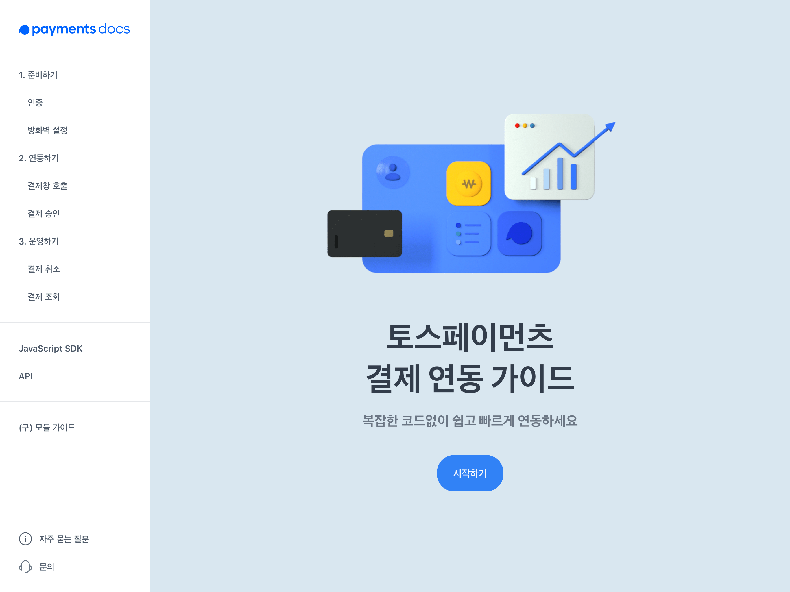

회고가 늦었습니다. 사실 2020년 연말에 약 열흘 간의 연휴기간이 생기면서 그동안 미뤄만 왔던 블로그 개편작업을 해보고자 삽을 떴어요. 그 결과물이 지금 보고 계신 웹 페이지인거구요. 열흘이나 있으니 공부도 해볼겸해서 새로운 언어, ReScript를 사용하기로 마음먹고 진행해봤는데 제가 스스로를 너무 과대평가한 건지 사소한 문제에도 트러블슈팅에 너무 질질 끌리면서 릴리즈가 늦어지게 되었습니다. 회고글은 미리 써두었지만, 이제야 회고 글을 공개하게 되었네요. 사실 지금도 대문도 없고.. 전혀 공개하고 싶은 퀄리티가 아닌데 이렇게 하다가는 한도 끝도 없이 밀리게 될 것 같아서 약간은 엉성한 상태지만 공개하게 되었습니다. (ㅠㅠ) 우선 이 상태로 앞으로 지속적으로 개선할까 합니다.

이후 본문에서 "올해"라고 통칭하는 것은 2020년입니다.

## 2020년

매 해마다 게을러지는 것 같다는 회고를 하게 되는데요. 올해도 마찬가지인 것 같습니다. 지금도 이렇게 막판에 와서야 회고글을 작성하고 있고요. 실제로 블로그 활동은 올 초에 썼던 책 리뷰밖에는 없네요. 코로나 여파로 오프라인 활동이 거의 제한되면서 GDG 활동도 거의 하지 않게 되었습니다. 책도 많이 읽지는 않은 것 같고요.

남는 시간에도 대체로 유튜브나 넷플릭스를 보면서 시간을 보냈던 것 같아요. 그래서 올해는 회고라고 하더라도 일 얘기 빼고는 특별히 언급할 내용이 많지가 않아 일 내용 중심으로 회고를 해볼까 합니다. 내년에는 부디 개인활동 위주로 회고할 수 있기를 바라며 🙏

## 다크모드와 TDS

올해 2월에 토스 앱의 다크모드가 배포되었습니다. 사실 토스에는 웹으로 구현되어있지만 앱과 거의 유사한 UX를 가진, 웹뷰 위에 구현되어있지만 웹처럼 보이지 않는 화면들이 많은데요. 토스 앱이 다크모드를 구현하기로 결정하게 되면서 이런 웹뷰로 구현된 화면들에도 다크모드 구현의 필요성이 생겼었어요. 프로젝트 시작부터 너무 흥미가 생겼던 프로젝트라서 제가 웹쪽 다크모드 구현에 발을 담그게 되었습니다. 사실 올해 시작한 프로젝트는 아니었고 작년 9월부터 진행해왔던 꽤 긴 과정이 있었어요. 세세한 과정들은 여기서 설명하는 것보다는 다행히 제가 FEConf에서 발표한 내용이 영상으로 남아있으니 한 번 궁금하신 분들은 보셔도 좋을 것 같습니다.

<iframe width="560" height="315" src="https://www.youtube.com/embed/ElsZ-v4Ow08" frameborder="0" allow="accelerometer; autoplay; clipboard-write; encrypted-media; gyroscope; picture-in-picture" allowfullscreen></iframe>

FEConf는 평소에도 꼭 한 번 쯤은 발표해보고 싶었고 마침 웹뷰에서의 다크모드 구현이라는 특수한 상황에서의 경험담이 좋은 주제라고 생각해서 발표하게 되었어요. 나름 반응이 괜찮아 좋았습니다. 반면에 아무래도 첫 온라인 발표다보니 좀 어색하긴 했던 것 같아요. 저는 발표할 때 아이컨택하면서 좀 마음의 안정을 회복하면서 발표하는데, 녹화할 때는 아이컨택할 분도 많지 않은데다 카메라 렌즈를 쳐다봐야 하는 점이 어렵더라고요. 그래서 발표하면서 많이 버벅였는데 다행히도 비교적 자연스럽게 잘 편집해주신 것 같습니다. 하지만 발표한 뒤에 제가 발표하는 영상을 보면서 실시간 채팅에 답해드리는게 가장 어려웠어요.. 질문에 대한 답보다는 제가 나온 영상을 보는게 ~~너무 오글~~ 쉽지 않은 일이더라구요.

당시 다크모드를 구현하면서 토스에서 사용하는 디자인 시스템인 TDS의 웹 구현체를 많이 손대야만 했는데요. 그러면서 자연스럽게 당시 공석이었던 TDS의 웹 구현체의 유지보수 책임도 가져오게 되었습니다. 사실 토스에 입사하던 시절부터 TDS에 큰 관심이 있었으니 TDS를 제가 주도적으로 다루는 것은 굉장히 즐거웠던 경험이었어요. 다크모드 구현만 한게 아니라 리팩토링이나 API 재설계 등의 작업도 병행하면서 개선된 API에 대해 다른 프론트엔드 개발자 분들이 좋아하시는 것도 너무 뿌듯했고요. 지금은 좋은 분이 오셔서 더 이상 제가 TDS를 맡고 있지 않지만 다른 개발자 분이 쓰는 API를 만든다는 것도 좋은 배움으로 이어질 수 있다는 경험을 했습니다.

기존 웹 TDS는 모바일 화면용 구현체였는데 사내 제품을 포함해서 점점 데스크탑(PC) 위주로 사용되는 제품이 점점 많아지다보니 TDS의 PC버전도 니즈를 느끼게 되었습니다. 이것도 역시 제가 맡게 되었는데, 맨 바닥부터 원하는 대로 설계해도 디자인 시스템 구현은 정말 어려운 일이라는 걸 느꼈습니다. 그래도 다른 분들께서 많이 도와주셔서 생각보다 크게 힘들지 않았고 현재는 잘 사용되고 있는 것 같아요.

## 토스페이먼츠로

올해 저에게 일어난 가장 큰 변화는 이직 아닌 이직(?)입니다. 비바리퍼블리카(토스)가 LG유플러스의 결제 사업을 인수하게 되면서 토스페이먼츠라는 계열사를 출범시키게 되었는데, 이 과정에서 저는 토스에 남지 않고 토스페이먼츠로 옮기는 선택을 했거든요. 당시 저는 원래 토스에서 보험쪽 업무를 하고 있었지만 제가 보험이라는 도메인에 큰 관심이 없기도 했고, 결제라는 도메인은 언젠가 개발자로서 한번 다뤄보면 좋은 지점이 아닌가 하는 생각, 그리고 과거에 제가 결제연동을 했던 경험을 떠올리며 제가 토스페이먼츠에서 가치를 만들어낼 수 있을 것 같아서 토스페이먼츠로 옮기기로 결정했습니다.

토스페이먼츠는 토스의 계열사인데도, 실제로 일하는 환경, 처우, 복지, 동료와 분위기, 전반적인 업무 경험이 거의 다르지 않아 좋았습니다. 하지만 어려운 점도 있었는데, 결제라는 도메인 자체가 가져다주는 어려움이 컸습니다. 제가 유저일 때는 그냥 단순한 결제로 보았지만, 그 결제 한 번에 물 밑에서 이루어지는 수 많은 상호작용들이 필요하다는 것을 체감하고 있어요. 지금도 결제 도메인을 잘 몰라요. (금융 쪽 도메인은 항상 어렵네요..)

법인 출범에 맞춰 [토스페이먼츠 결제 연동 가이드](https://docs.tosspayments.com/)와 [JavaScript SDK](https://www.npmjs.com/package/@tosspayments/sdk)를 배포했는데, 둘다 처음해보는 경험이라 신선했습니다. 결제 연동 가이드 문서는 전문 라이터가 없어서 제가 문서의 많은 부분을 작성했는데, 때문에 읽기 좋고 쉬운 문서를 작성하는 법에 대한 고민을 많이 했었습니다. 아직 부족한 점이 많지만 MVP로서는 충분한 문서를 만들었다고 생각합니다. JavaScript SDK 자체가 하는 일은 간단히 결제창을 가맹점 웹사이트에 Embed하는 것이었기 때문에 크게 어려운 점은 없었습니다. 주로 고민했던 것은 기능적인 측면보다는 어떻게 하면 직관적으로 이해하기 좋으면서도 사용하기 편리한 라이브러리 API를 만들 수 있을까 하는 부분이었어요. 현실은 대부분 네이밍에 대한 고민이긴 했지만요. 지금 만들어진 결과물이 완벽하지는 않지만 앞으로도 지속적으로 개선할 것 같습니다.

프론트엔드 개발자도 처음엔 저 혼자 있었지만 지금은 토스에서 도와주시는 분까지 포함해서 네 명이서 즐겁게(?) 일하고 있어요. 다른 분들 모두 개발 잘하시는 분이라서 요즘 늘 감사한 마음으로 개발하는 것 같습니다. 다만 해야할 일이 많은데 새로운 분을 못 모신지 한참 되어서 걱정이 많긴 하네요. ([토스페이먼츠에 관심이 있으시다면..](https://toss.im/career/job-detail?job_id=4076143003))

## 블로그

올해는 이 글을 제외한다면 단 한 개의 글만 작성했습니다. 매년 반성하면서도 개선하지 못하고 있는게 참 안타깝고 한편으로는 뒤처지는 느낌이라 두렵기도 해요.

그래서 새로운 블로그 작업을 시작하게 된 것 같아요. 이전에 사용하던 블로그에서 아쉬웠던 점, 이번에 넣어보고 싶었던 기능 등등 개선하고 싶은 것은 뭐든 해보려고 합니다. 아직은 여러가지 면에서 완성도가 떨어지는 상태라 당분간은 지속적으로 완성도를 개선해야 할 것 같아요. 서두에도 밝혔듯 ReScript를 사용했는데 저에게는 너무 어려워서 현재 작업속도가 매우 느린 상태라 언제 가능할지 모르겠지만요. 약간의 공부는 됐지만 적절하지 못한 선택을 했던 것 같아서 조만간 타입스크립트로 변경하려고 합니다. 추후에 완성도 조금 올라가고 어느 정도 코드도 정리가 되면 오픈소스로 공개할게요.

## 2021년

원래 매년 말마다 목표를 설정했었는데, 자꾸 돌아보지 않다보니 말뿐인 목표가 되는 것 같아 그냥 목표를 설정하지 않으려고 합니다. 다만 그렇다고 성장이나 자기계발을 멈추겠다는 건 아니에요. 목표보다는 당장 앞에 있는 일을 실행하려고 노력하려고 합니다. 어차피 백로그는 많으니까요. 블로그도 이렇게 새로 만들었으니 새해에는 글로도 많이 찾아 뵙겠습니다.

코로나로 아직까지 어지러운 상황이지만 빨리 진정되어서 오프라인으로 만날 수 있었으면 좋겠네요. 2021년 순탄하게 보내세요. 감사합니다.
