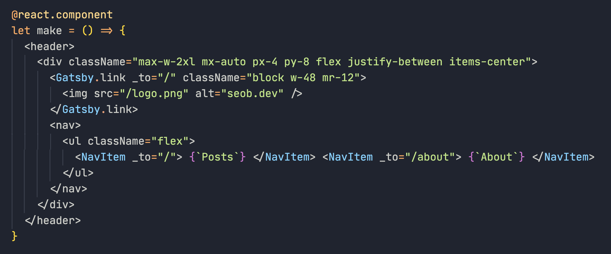

# ReScript 소개

본격적으로 ReScript를 소개하기 앞서 얘기하고 싶은 내용이 있는데요. 제가 ReScript를 공부하기 시작하면서 가장 혼란스러웠던 점은 많은 용어들이 혼재되어 사용되고 있다는 점이었어요. ReScript, Reason(ReasonML), OCaml, BuckleScript 등, 다양한 용어가 ReScript 생태계 속에서 사용되고 있는데요. ReScript를 잘 이해하기 위해서는 이 용어들에 대해서 짚고 넘어갈 필요가 있을 것 같습니다.

## Reason

Reason은 React를 만든 [Jordan Walke](https://twitter.com/jordwalke)라는 분이 만든 언어입니다. OCaml이라는 강력한 타입시스템을 지닌 함수형 프로그래밍 언어를 기반으로 합니다. OCaml이 비교적 대중적인 JavaScript나 C 기반 언어의 개발자에게는 문법이 생소하고 어렵다보니 개발자도 친숙하게 사용할 수 있는 언어로 디자인했다고 공식문서에서 설명하고 있습니다.

후술할 BuckleScript를 이용해서 JavaScript로 컴파일 할 수도 있지만, Go나 Rust처럼 네이티브 환경에서 실행가능한 바이너리로도 만들 수 있다고 합니다.

확장자는 `.re` 를 사용합니다.

## BuckleScript

BuckleScript는 컴파일러입니다. 앞서 말씀드린 OCaml을 JavaScript로 변환해주는 컴파일러에요. Reason은 OCaml AST로 변환이 가능하니, 결과적으로 BuckleScript를 백엔드로 사용해서 Reason을 JavaScript로 컴파일 하는 것이 기본 원리입니다.

## Reason + BuckleScript = ReScript


이미지 출처: [A New Logo for ReScript | ReScript Blog](https://rescript-lang.org/blog/new-rescript-logo)

2020년에 Reason과 BuckleScript를 합쳐 JavaScript로 컴파일하는 프로젝트는 ReScript라는 프로젝트로 재탄생합니다.

"[BucketScript is Rebranding](https://rescript-lang.org/blog/bucklescript-is-rebranding)"이라는 글을 보면 왜 기존 구조에서 ReScript로 옮겨가게 되었는지를 설명하는데, 가장 큰 이유로 "학습의 어려움"을 꼽고 있습니다. 특히, Reason으로 요즘 프론트엔드에서 가장 많이 선택하는 React 앱을 개발하는 케이스에서 일어날 수 있는 어려움에 대해서 설명합니다.

Reason으로 React를 개발하기 위해서는 당장 JavaScript / React / Reason 은 물론이고, ReasonReact라는 Reason → React 바인딩, OCaml, BuckleScript에 대한 얕은 지식도 어느정도 요구하게 된다는 것이죠. 이렇게 알아야 할 것이 많다보니 아무래도 JavaScript 만을 다뤄본 사람의 입장에서는 어렵다고 느낄만 합니다.

이런 어려움 때문에 JavaScript가 실행되는 환경만 포커스하는 새로운 언어의 필요성을 느끼게 된 것이고, ReScript의 탄생으로 이어지게 된 것입니다. 이렇게 ReScript로 새롭게 브랜딩하고 OCaml을 탈피하게 되면서 OCaml과의 호환을 위해서 지켜야 하는 제약조건에서 자유로워지게 되어 더 JavaScript 개발자에게 더욱 친숙한 문법을 선택할 수 있게 되었다고 합니다.

현재로서는 리브랜딩 된지 얼마되지 않아 ReScript가 ReasonML과 BuckleScript의 시스템을 거의 그대로 갖고 있습니다. 문법적인 차이 외에는 거의 대부분의 것들이 동일해요. 그래서 트러블 슈팅할 때에나 레퍼런스를 참고할 때 꼭 ReScript로 검색할 필요가 없고 Reason으로 검색해서 나온 해결책도 적용할 수 있습니다.

ReScript는 확장자로 `.res` 를 사용합니다

# 좋았던 점

이 블로그를 새로 만들면서 몇 달 동안 얕게나마 ReScript를 사용해 보았습니다. 처음 접했던 언어였던 만큼 생소하거나 어렵고, 좋거나 아쉬웠던 점이 있는데요. 먼저 좋았던 점을 말씀드릴게요.

## Readable Output

앞서 설명드렸듯이 ReScript를 컴파일하면 JavaScript가 나옵니다. 이 때 컴파일 결과는 우리가 일반적으로 짜는 코드와 크게 다르지 않습니다. 그렇기 때문에 이 컴파일 결과로 나온 코드를 읽고 이해하기에도 충분합니다. 예를 들어 아래와 같은 코드가 있다고 가정할게요.

```rescript
let add = (a, b) => {
  a + b // ReScript는 마지막 구문을 묵시적으로 리턴합니다.
}
```

이 코드는 컴파일을 통해 아래의 코드로 변환됩니다.

```js
// Generated by ReScript, PLEASE EDIT WITH CARE

function add(a, b) {
  return (a + b) | 0;
}

export { add };
/* No side effect */
```

물론 예제가 너무 간단한 코드이기도 하지만, 어쨌든 사람이 짰다고 해도 믿을만한 코드가 나옵니다.

ReScript 입문자 입장에서 컴파일 결과물이 Readable하다는 것은 어떤 문제가 발생했을 때 이 문제가 ReScript 언어에서 발생한 문제인지, 그 외의 문제인지 이해하기가 편리하다는 것을 의미합니다. 그냥 결과물 JavaScript를 읽어봤을때 잘못된 부분이 있는지 확인해보면 되니까요. 또, 컴파일 결과물을 확인함으로써, 이 언어의 어떤 문법이 어떻게 동작하는지 이해하기도 쉽습니다. 디버깅도 해당 JavaScript 파일을 보면 되니 어렵지 않죠. 실제로 저도 트러블 슈팅을 위해서 생성된 JavaScript 파일을 확인해서 문제를 해결한 적이 있습니다.

## 모듈 시스템

ReScript 는 명시적인 `import` / `export` 문을 사용하지 않습니다. 대신 모든 파일이 모듈입니다! 예를 들면,

```rescript Math.res
let add = (a, b) => {
  a + b
}
```

```rescript
// Print 15
Js.Console.log(Belt.Array.reduce([1, 2, 3, 4, 5], 0, Math.add))
```

이런식으로 명시적인 `export` 없이도 다른 파일의 모듈을 사용할 수 있습니다. JavaScript나 TypeScript를 사용할 때는 예쁘게 모듈을 `import` 하기 위해서 `index.js` 같은 파일들을 많이 작성해보신 경험들이 다들 한 번 쯤은 있으실텐데, 이런 귀찮은 일이 없어서 저는 편리하다고 느꼈어요.

다만 이 때문에 모든 파일명이 유니크해야 한다는 제약이 생깁니다. 큰 프로젝트를 할 때는 이게 문제일텐데, 이 문제를 해결하기 위해 [모듈 네임스페이싱](https://2ality.com/2017/12/modules-reasonml.html#namespacing-modules) 이라는 패턴을 참고할 수 있습니다.

## 강력한 타입 시스템

다음 코드는 타이핑이 되어있을까요?

```rescript
let add = (a, b) => {
  a + b
}
```

TypeScript에 익숙하신 분들은 아마도 `no-implicit-any` 에러가 날 꺼라고 예상하실 것 같아요. 하지만 ReScript에서 위 코드는 타이핑이 되어있습니다.

```rescript
let add = (a, b) => {
  a + b
}

add(`1`, `2`)
```

```bash
31 │ add(`1`, `2`)

This has type: string
Somewhere wanted: int
```

어떤 과정으로 이 코드가 타이핑이 된 걸까요?

1. ReScript에서 `+` 오퍼레이터는 `int` 타입에만 사용가능합니다.
2. 따라서, `a + b` 라는 구문이 타입 안전하려면, 이 구문 안에서 `a` 와 `b` 는 반드시 `int` 타입이어야 합니다.
3. 그런데, ReScript에서 모든 식별자는 불변입니다.
4. 파라미터로 받은 `a` 와 `b` 역시 불변이므로 중간에 다른 값이 될 가능성은 없다는 것이 보장됩니다. 따라서, 다른 타입도 될 수 없습니다.
5. 따라서 파라미터 `a` 와 `b` 는 `int` 타입임을 보장할 수 있습니다. ✅

논리적으로 말 되죠? 이게 ReScript가 타입을 추론하는 방식입니다. ReScript의 강력한 타입추론 기능은 [힌들리-밀러 타입 시스템](https://en.wikipedia.org/wiki/Hindley%E2%80%93Milner_type_system)에서 왔습니다. ReScript의 원형인 ReasonML이 ML계열 언어이고, 힌들리-밀러 타입시스템을 최초로 구현한 언어가 ML이라고 합니다.

ReScript는 런타임에서 null / undefined로 인한 에러가 나지 않음을 보장하는 것도 힌들리-밀러 타입 시스템을 쓰기 때문이라고 할 수 있습니다.

이렇게 ReScript는 프로그래머가 직접 타이핑을 할 필요가 없도록 해줄 정도로 많은 부분에 타입 추론을 해줍니다. 따라서 다음과 같은 코드도 타입 에러가 나지 않습니다.

```rescript
let echo = a => {
  a
}
```

위 코드는 TypeScript라면 "Implicit any" 오류가 났겠지만, ReScript에서는 오류가 나지 않습니다. ReScript에는 TypeScript Generic과 비슷한 개념인 Type Parameter라는 개념이 있는데요. 이렇게 아무 Type Annotation이 없으면 자동으로 Type Parameter로 동작하게 해줍니다. 위 코드는 TypeScript에서는 아래 코드와 비슷하다고 볼 수 있겠습니다.

```ts
function echo<T>(a: T) {
  return a;
}
```

# 아쉬웠던 점

## 과도기적 혼란

ReScript로 리브랜딩 된것이 반년밖에 되지 않았습니다. 워낙 ReScript가 초기다보니 트러블 슈팅때 검색해도 나오는 레퍼런스가 거의 없습니다. 어찌저찌 레퍼런스를 찾으면 거의 Reason 기반이고, ReScript로 시작한 저는 어찌 적용해야할지 이해가 어려워 난감한 경우가 몇 번 있었습니다. 지금은 어느정도 적응을 해서 호환 문법을 찾아보고 적용을 할 수는 있게 되었지만, 아무래도 Reason, ReScript 문서를 모두 참고하고 적용해야하는 점도 불편한 점인 것 같아요.

마이너한 아쉬움이긴 하지만 아직 리브랜딩은 되었음에도 BuckleScript의 흔적이 많이 남아있습니다. 대표적으로, 특별한 설정을 더하지 않으면 컴파일 된 JavaScript의 확장자 `.bs.js` 가 BuckleScript의 흔적이라고 볼 수 있겠네요. 이외에도 대부분의 라이브러리가 `bs-` prefix를 가지고 있고, 설정 파일 이름이 `bsconfig.json` 인 것도 있고요. 고칠 계획이 있는지는 잘 모르겠지만요.

## 높은 진입장벽 😭

TypeScript는 JavaScript의 Superset을 지향하는 만큼, Type Annotation을 추가해야하는 것을 제외하면 JavaScript와 문법이 거의 같아서 처음 적용할 때 어렵지 않았던 것 같습니다. ReScript 역시 JavaScript와 문법을 유사하게 만들기 위한 노력이 있었지만, 저한테는 생소한 부분들이 많이 있었고 근본적으로 문법이 비슷하다고 볼 수는 없을 것 같습니다. 이렇게 익숙하지 않은 문법 자체는 물론 초기 진입장벽으로 작용할 수 있습니다.

또한 일단 돌아가게끔 만드는게 쉽지가 않았습니다. 저는 트러블 슈팅을 하고 있을 때 답답하고 일이 진척이 안되는 느낌을 많이 받으면 쉽게 집중력을 잃게 되는 경향이 있는데요. 그래서 일단 화면으로 뭘 보면서 하면 능률이 좀 올라가는 편이에요. 저한테는 일단 돌아가는 앱을 만들기가 어려워서 작업 능률이 좋지 않았습니다. 앞서 말씀드렸던 ReScript로 리브랜딩 한 이유 중, React 앱을 만들기 위해서 너무 여러가지 배경지식이 필요하다는 점을 언급했었습니다. 이 점이 리브랜딩 했다고 해서 해결된 것이 아니라 문제가 남아있습니다. 여전히 ReasonReact 배경지식을 익혀야하고, Reason과 ReScript 사이에서 헤매기 쉽습니다.

추가적으로 함수형 프로그래밍 방식에 익숙하지 않은 경우는 더더욱 쉽지 않을 것 같고, TypeScript에 비해서 Strict한 타입 시스템도 이전까지 정적 타입 언어를 작성해본 경험이 없으신 분께는 꽤 큰 장벽으로 작용할 수도 있겠다는 생각도 들었습니다.

## 툴링 / 에디터 지원



아직까지 VSCode에서 [JSX 문법 하이라이팅을 지원하고 있지 않습니다](https://github.com/rescript-lang/rescript-vscode/issues/21). 그리고 제가 많이 사용하는 Go to definition이나 Pick definition 같은 기능도 아직 잘 안되는 것이 불편했습니다.

저는 ReScript + Gatsby 개발환경에서 작업했는데요. Gatsby와 ReScript를 통합하기 위해서 ReScript 컴파일과 Gatsby develop 프로세스를 별도로 돌려줘야 합니다. 따라서 concurrently를 쓰거나, 터미널을 두개 켜놔야 하죠.

```bash
$ yarn bsb -make-world -clean-world -w # ReScirpt watch 명령어
$ yarn gatsby develop
```

물론 이 부분은 시간이 지나서 생태계도 좋아지고 쓰는 사람이 많아지면 통합하는 툴도 나올 수 있고, 차차 해결될 것이라 예상합니다.

## 깐깐한 타입 시스템

ReScript는 적당히 널널(...)한 TypeScript와는 달리 상대적으로 더 Strict한 타입 시스템을 가지고 있습니다.

- Array에 넣을 수 있는 타입은 한가지 타입으로 제한됨
- 함수 오버로딩과 가변인자 함수(Variadic Function)을 지원하지 않음

위 두가지 특징 때문에 React를 쓸 때 다음과 같이 불편한 코드를 마주칠 수 있습니다.

```rescript
// Runs after every completed render
React.useEffect(() => {
  // Run effects
  None // or Some(() => {})
})

// Runs only once right after mounting the component
React.useEffect0(() => {
  // Run effects
  None // or Some(() => {})
})

// Runs everytime `prop1` has changed
React.useEffect1(() => {
  // Run effects based on prop1
  None
}, [prop1])

// Runs everytime `prop1` or `prop2` has changed
React.useEffect2(() => {
  // Run effects based on prop1 / prop2
  None
}, (prop1, prop2))

React.useEffect3(() => {
  None
}, (prop1, prop2, prop3));

// useEffect4...7 with according dependency
// tuple just like useEffect3
```

이 코드는 rescript-react 라는 ReScript의 React 공식 바인딩 라이브러리 예제 코드입니다. 원래 `useEffect` 에 두 번째 인자로 넘기는 `deps` 에 보통 여러 가지 타입을 가진 변수를 넘기기 마련인데, Array는 한 가지 타입만 가질 수 있기 때문에 이를 해결하기 위해서 Tuple을 사용해야 합니다. 그런데 가변인자 함수를 지원하지 않기 때문에 같은 이름을 가진 함수를 여러 시그니처를 지원하도록 사용할 수 없습니다. 결과적으로.. 이렇게 `useEffect` 훅을 위해 여러 함수가 필요하게 된거죠 😓

물론 이 아쉬운 점은 앞서 설명드렸던 강력한 타입 시스템을 위한 트레이드오프로 봐야한다는 생각입니다. 하지만 ReScript도 JavaScript 생태계에서 완전히 자유로울 수는 없고, 기존 npm 생태계 등을 활용해야할 필요성도 있기 때문에 이런 사례는 점점 더 많아질 수 있을 것 같아요.

# 결론

## ReScript의 전망은 어떨까요?

ReScript를 소개하는 문서를 읽어보면 다음과 같은 문장이 나옵니다.

> TypeScript's (admittedly noble) goal is to cover the entire JavaScript feature set and more. **ReScript covers only a curated subset of JavaScript.**

TypeScript가 JavaScript의 Superset을 지향하는 것과 달리, ReScript는 JavaScript의 Subset을 지향합니다. 이런 차이는 결과적으로 TypeScript의 컴파일러를 점점 복잡하게 만들 수 밖에 없습니다. JavaScript에 문법이 추가되면 TypeScript 컴파일러는 이것을 지원해야만 하거든요. TypeScript 컴파일러는 점점 복잡해지면서 점점 느려지겠죠.

반면에 ReScript는 JavaScript의 Subset을 지향하기에 JavaScript에 새로운 문법이 추가되더라도 지원 여부를 결정할 수도 있고, 꼭 JavaScript 문법을 통해 지원하지 않아도 됩니다. 이것은 결국 컴파일러의 복잡성을 낮게 유지할 수 있는 기반이 되기 때문에 ReScript의 컴파일러는 지금도 빠르지만, 앞으로 이 격차는 더욱 커지지 않을까 싶습니다. 지금도 빠른 컴파일 속도는 굉장히 만족스러워요.

그렇다고 ReScript가 TypeScript를 밀어내고 그 자리를 차지할 거라고 생각하지는 않습니다. ReScript는 TypeScript에 비해 진입장벽이 높기 때문에 앞으로도 상대적으로 유입이 많지 않을거라고 생각해요. 호불호가 갈릴 수 있는 언어라고 생각하고, Quick & Dirty 좋아하는 분은 시도해봤다가도 금방 이탈하지 않을까 생각합니다. 안 써야할 이유를 맘먹고 찾으면 많거든요.

다만 어느정도의 포션은 차지할 수 있을 거라고 기대합니다. ReScript의 소개 문서에 보면 또 이런 문장이 나옵니다.

> Migrating to TypeScript is done "breadth-first," whereas migrating to **ReScript is done "depth-first."**

ReScript가 지향하는 바 자체가 넓은 범위를 커버하는게 아니라 좁은 범위라도 확실히, 깊게 커버하는 것입니다. ReScript는 "좁더라도 깊게" / "JavaScript의 서브셋 지향" / "함수형 프로그래밍 언어" 라는 확실한 차별점이 존재하기 때문에 이 방향성에 공감하는 사람들의 굳건한 지지기반을 얻을 수 있다고 생각합니다. 그렇기 때문에 대중적으로 사용되긴 어렵더라도 어느정도의 포션은 차지하지 않을까 하는 생각입니다. 제 생각에는 같은 카테고리 언어(JavaScript로 컴파일 되는 함수형 프로그래밍 언어) 중에서는 가장 높은 포션을 차지할 수 있지 않을까 합니다.

## 지금 도입해도 괜찮을까요?

(당연히) 사람이나 회사에 따라 다를 수 있겠지만 현 상태에서도 충분히 프로덕션 레벨의 제품은 만들 수 있는 언어라고 생각합니다. 그래서 본인이 충분히 자신이 있고 앞서 말씀드린 단점에도 불구하고 ReScript의 철학이 본인 생각과 잘 맞아 떨어진다고 생각하시는 분들은 충분히 도입을 검토할 수 있는 레벨인 것 같습니다. 이미 프로덕션 레벨 활용사례는 Reason 시절부터 있었고요. 한국에서는 [그린랩스](https://green-labs.github.io/)가 잘 쓰고 있는 것으로 알고 있습니다. 저도 그린랩스 덕분에 "한 번 해볼까?"하고 블로그로 시작한 케이스고요. 지금 블로그 만드는데 있어서 작업 속도는 TypeScript 쓸 때에 비하면 느리긴 하지만 아예 못 만들 정도는 아니었어요.

그럼에도 불구하고 일반적으로는 섣불리 추천하기가 어렵다는 생각입니다. 가장 크게 망설여지는 부분이 툴링이나 에디터 지원인데요. 이 부분은 시간이 지나면 확실히 해결될 것이라고 예상하기 때문에 조금 기다려보는 것도 좋겠습니다.

딱히 작업 속도가 중요하지 않은 사이드 프로젝트 정도라면 적용해볼 수 있다고 생각하고요. 개인적인 성장이나 스터디를 목표로 하시는 것도 물론 말릴 이유는 없을 것 같아요.

개인적인 경험을 더 말씀 드리자면, 처음엔 너무 작업 효율이 떨어져서 많이 후회했고, "지금이라도 TypeScript로 돌릴까?" 하는 생각을 많이 했던 것 같아요. 그런데 이 글 정리하면서 ReScript의 철학과 방향성에 좀 공감을 하게 되어서 최소한 1년 정도는 시행착오 겪어보면서 ReScript를 통해 블로그 개발을 더 해볼까 합니다.

그럼 다음에 또 다른 ReScript 관련 글로 찾아뵐게요. 감사합니다.

# 더 읽어보기

- [Introduction | ReScript Language Manual](https://rescript-lang.org/docs/manual/latest/introduction)
- [그린랩스가 ReasonML에서 리스크립트로 바꾸는 이유](https://green-labs.github.io/why-rescript)
- [How I Switched from TypeScript to ReScript](https://medium.com/att-israel/how-i-switched-from-typescript-to-rescript-637aa5ef8d3)
